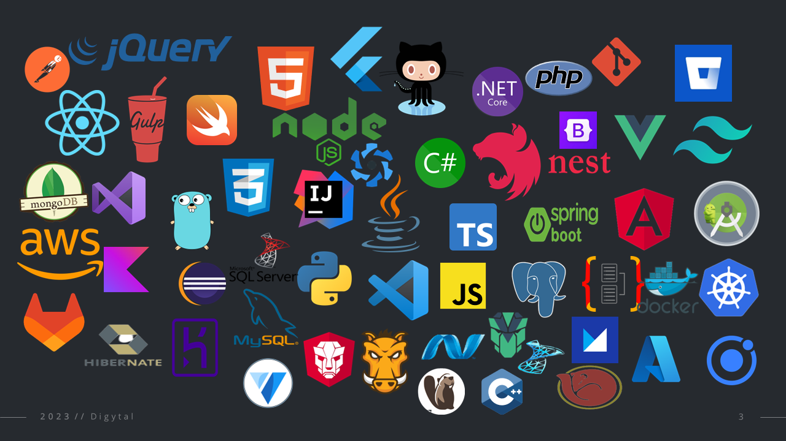

# A Proposta

## Para refletir

Que tal direcionar seus estudos em programação canalisando todos os seus esforços para aprender uma ou mais linguagens, seus frameworks e as tecnologias necessárias para desenvolver um sistema de gestão de cadastros e contas correntes?

Nada há maneira mais produtiva para aprender programação quando se há o intuíto de adequirir habilidades de raciocíneo lógico e dominar as tecnologias necessárias com a finalidade de solucionar uma necessidade real em automatização de processos.

Acreditamos que hoje, a maior barreira pra se tornar um programador preparado para o mercado, é identificar o que é necessário estudar, definir um plano de estudos e como explorar tais tecnologias de forma produtiva.

É necessário que você tenha ciência de uma jornada constante de estudos, realização de muitos exercícos de raciocíneo lógico e programação, pois, é somente desta maneira que você se tornará um profissional preparado para o mercado.

::: tip :trophy: Sucesso
Para te auxiliar quanto a uma trilha das tecnologias que você mais possa se identificar, segue [Link](https://www.youtube.com/watch?v=8q5YO9YUMz8&list=PL8NbPylKQ8Nnq2UIwYcJslDAbEUqOZx0P&index=5&t=1s) do nosso vídeo explicativo.
:::

## Cadastros e Contas Correntes

99,9% dos sistemas comerciais existentes no mercado necessitam de um cadastro básico de seus clientes, pacientes ou correntistas. Tudo depende de um contexto do negócio do usuário, exemplo: Lojas, Clíncias, Oficinas, Bancos, Cartórios e etc.

E para tornar um pouco mais dinâmica a nossa jornada de aprendizagem, iremos mergulhar em contexto de desenvolver uma plataforma de dados cadastrais e gestão de contas correntes dos clientes de uma determinada instituição financeira.

