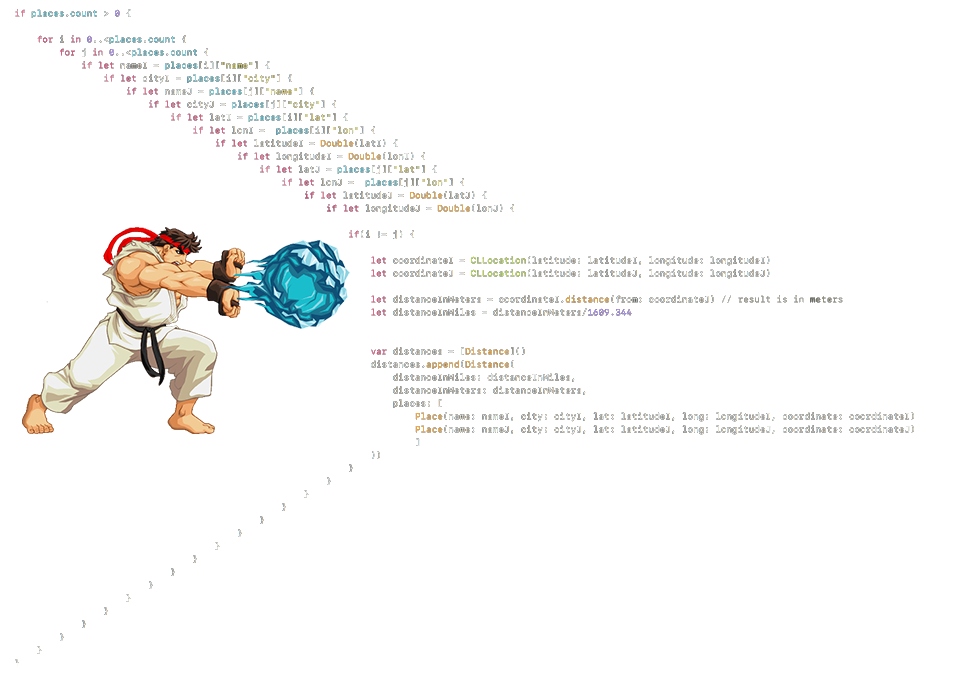

# Sintaxe e Semântica

Tudo na vida possui forma e conteúdo, mas um bom conteúdo com forma ruim é problema, e uma forma bacana com conteúdo ruim, pior ainda.

Projetar software é lidar com isso toda hora. Modelos, especificações, código: precisam de uma boa forma (sintaxe) e um bom conteúdo (semântica). Entender como ter qualidade na sintaxe e na semântica é fundamental!

Na Engenharia de Software quando falamos de sintaxe geralmente nos referimos à forma de escrever código fonte (palavras reservadas, comandos, recursos diversos).

Quanto à semântica, de um modo geral é o estudo do significado das coisas (do conteúdo das “formas”). Na Engenharia de Software, quando falamos de semântica nos referimos ao significado dos modelos, ao nível de entendimento (clareza, objetividade, detalhamento, coesão etc.) de alguma coisa.

Por exemplo: uma redação bem escrita (sem erros de concordância, gramática etc.), mas com um texto ruim (sem contexto, sem início/meio/fim, com uma estória confusa) possui boa “sintaxe”, mas uma “semântica” ruim.

## Anatomia e escopo

Em Ciência da Computação escopo é um contexto delimitante aos quais valores e expressões estão associados. Linguagens de programação têm diversos tipos de escopos. O tipo de escopo vai determinar quais tipos de entidades este pode conter e como estas são afetadas, em outras palavras, a sua semântica. 

Normalmente, o escopo é utilizado para definir o grau de ocultação da informação, isto é, a visibilidade e acessibilidade às variáveis em diferentes partes do programa. Escopos podem:

* Conter declarações ou definições de identificadores;
* Conter instruções e/ou expressões, que definem um algoritmo executável ou parte dele;
* Aninhar ou ser aninhados.

::: info :information_source: Informação
Em resumo, escopo é a acessibilidade de objetos, variáveis e funções em diferentes partes do código.
:::

A grande maioria das linguagens oferecem uma estrutura bem definida de codificação, seguindo o pseudocódigo conforme abaixo:

```java
class { 

  //escopo global ou de classe
  globalNumber = 10

  methodOne(){
    //escopo de método
    myNumber = 1

    print(globalNumber)  //10
  }

  methodTwo(){
     //escopo de método
    myNumber = 1
    
    //escopo de bloco ou de fluxo
    if(true){

        yourNumber = 2

        myNumber = yourNumber
    }

    print(myNumber) //2
    print(yourNumber) //error - acesso somente dentro do fluxo
  
  }

}
```

### Anatomia das classes

```java
public class MinhaClasse {

  //SEU CÓDIGO AQUI

}
```

- 99,9% das nossas classes iniciarão com `public class`.
- Toda classe precisa de nome, exemplo `MinhaClasse`.
- Após o nome, precisamos definir o corpo { } onde iremos compor nossas classes com atributos e métodos.
  
````java
public class MinhaClasse {
  // CORPO DA CLASSE

  public static void main(String[] args) {
    // CORPO DO MÉTODO MAIN
  }

}
````

- É de suma importância, que agora você consiga se localizar,dentro do conjunto de chaves { } existentes em sua classe.
- Dentro de uma aplicação, **recomenda-se que somente uma classe possua o método** `main`, responsável por iniciar todo o nosso programa.
- O método main recebe seu nome main, sempre terá a visibilidade public, será definido como static, não retornará nenhum valor com `void`,e receberá um parâmetro do tipo array de caracteres `String[]`.

### Padrão de nomenclatura

Quando se trata de escrever códigos na linguagem Java, é recomendado seguir algumas convenções de escrita. Esses padrões estão expressos nos itens abaixo:

- Arquivo .java: Todo arquivo .java deve começar com letra MAIÚSCULA. Se a palavra for composta, a segunda palavra deve também ser maiúscula, exemplo:
  
  `Calculadora.java`, `CalculadoraCientifica.java`

- Nome da classe no arquivo: A classe deve possuir o mesmo nome do arquivo.java, exemplo:

```java
// arquivo CalculadoraCientifica.java

public class CalculadoraCientifica {

}
```

- Nome de variável: toda variável deve ser escrita com letra minúscula, porém se a palavra for composta, a primeira letra da segunda palavra deverá ser MAIÚSCULA, exemplo: ano e anoFabricacao. O nome dessa prática para nomear variáveis dessa forma se chama "camelCase".

::: info :information_source: Informação
Existe uma regra adicional para variáveis, quando na mesma queremos identificar que ela não sofrerá alteração de valor, exemplo: queremos determinar que uma variável de nome br sempre representará "Brasil" e nunca mudará seu valor, logo, determinamos como escrita o código abaixo:
:::

```java
String BR = "Brasil"
double PI = 3.14
int ESTADOS_BRASILEIRO = 27
int ANO_2000 = 2000
```

::: danger :rotating_light: Atenção
Recomendações: Para declarar uma variável nós podemos utilizar caracteres, números e símbolos, porém, devemos seguir algumas regras da linguagem.
:::

- Deve conter apenas letras, _ (underline), $ ou os números de 0 a 9;
- Deve obrigatoriamente se iniciar por uma letra (preferencialmente), _ ou $, jamais com número;
- Deve iniciar com uma letra minúscula (boa prática – ver abaixo);
- Não pode conter espaços;
- Não podemos usar palavras-chave da linguagem;
- O nome deve ser único dentro de um escopo.

```java
// Declação inválida de variáveis

int numero&um = 1; //Os únicos símbolos permitidos são _ e $
int 1numero = 1;    //Uma variável não pode começar com númerico
int numero um = 1; //Não pode ter espaço no nome da variável
int long = 1; //long faz parte das palavras reservadas da linguagem
 
 // Declaração válida de veriáveis
int numero$um = 1;
int numero1 = 1;
int numeroum = 1;
int longo = 1;
```

### Estrutura de variáveis e métodos

Como identificar a diferença entre, declaração de variáveis e métodos em nossa programa? Existe uma estrutura comum para ambas as finalidades, exemplo:

- Declarar uma variável em Java segue sempre a seguinte estrutura:

```java
// Estrutura

Tipo NomeBemDefinido = Atribuicao (opcional em alguns casos)

// Exemplo

int idade = 23;
double altura = 1.62;
Dog spike; //observe que aqui a variável spike não tem valor, é normal
```

- Declarar métodos em Java segue uma estrutura bem simples:

```java	
// Estrutura

TipoRetorno NomeObjetivoNoInfinitivo Parametro(s)

//Exemplo

int somar (int numeroUm, int numero2)

String formatarCep (long cep)
```

::: warning :bell: Atenção
Como parte da estrutura de declaração de variáveis e métodos, também temos o aspecto da **visibilidade**, mas ainda não é necessário nesta etapa de estudos.
:::

### Estrutura de Indentação

Basicamente **indentar** é um termo utilizado para escrever o código do programa de forma hierárquica, facilitando assim a visualização e o entendimento do programa.



Abaixo, veja um exemplo de um algoritmo de validação, de aprovação de estudante.

- Sem Indentação:

```java
// arquivo BoletimEstudantil.java

public class BoletimEstudantil {
public static void main(String[] args) {
int mediaFinal = 6;
if(mediaFinal<6)	
System.out.println("REPROVADO"); 
else if(mediaFinal==6)
System.out.println("PROVA MINERVA"); 
else
System.out.println("APROVADO"); 		
}
}
```

- Com Indentação:

```java
public class BoletimEstudantil {
	public static void main(String[] args) {
		int mediaFinal = 6;
		if (mediaFinal < 6)
			System.out.println("REPROVADO");
		else if (mediaFinal == 6)
			System.out.println("PROVA MINERVA");
		else
			System.out.println("APROVADO");
	}
}
```


## Tipos e variáveis

#### Tipos de dados

Em Java, existem palavras reservadas especiais para representar tipos básicos de dados que são essenciais para construir programas. Estes tipos básicos são chamados de tipos primitivos.

::: info :pushpin: Os oito tipos primitivos em Java são:
int, byte, short, long, float, double, boolean e char – esses tipos não são considerados objetos e portanto representam valores brutos. Eles são armazenados diretamente na pilha de memória. 
:::

Tabela de Tipos Primitivos e seus valores:

| Tipo  | Memória | Valor Mínimo               | Valor Máximo              |
| ----- | ------- | -------------------------- | ------------------------- |
| byte  | 1 byte  | -128                       | 127                       |
| short | 2 byte  | -32.768                    | 32.767                    |
| int   | 4 bytes | -2.147.483.648             | 2.147.483.647             |
| long  | 8 bytes | -9.223.372.036.854.775.808 | 9.223.372.036.854.775.807 |

Os tipos primitivos, que podem conter partes fracionárias podem ser representados por dois tipos:

| Tipo   | Memória | Valor Mínimo   | Valor Máximo  | Precisão      |
| ------ | ------- | -------------- | ------------- | ------------- |
| float  | 4 bytes | -3,4028E + 38  | 3,4028E + 38  | 6 – 7 dígitos |
| double | 8 bytes | -1,7976E + 308 | 1,7976E + 308 | 15 dígitos    |


Embora o tipo `float` ocupe menos espaço na memória do que o tipo `double`, ele é menos utilizado devido a uma limitação na precisão decimal entre 6 e 7 dígitos. 

Com os avanços nos computadores, não há mais a necessidade de se preocupar com o uso dos tipos `short` e `byte`, pois a memória é abundante. 

De maneira semelhante, o tipo `long` também é pouco utilizado, pois valores tão grandes são raros de se trabalhar. 

Portanto, na maioria das situações, utilizamos o tipo `int` para representar números inteiros ou `double` para representar números fracionados.


::: tip :bulb: O ponto mais relevante, em compreender a definição dos tipos de dados é o momento da definição do tipo para uma variável. _Qual tipo de dados eu utilizaria para determinar a idade de uma pessoa ou o salário de um funcionário?_
:::

## Declaração e atribuição

Declaração e atribuição de variáveis é uma das etapas fundamentais em programação, pois permite armazenar dados na memória do computador para uso futuro. A aplicação de regras claras e precisas ajuda a evitar erros de sintaxe e de lógica, bem como torna o código mais legível e fácil de manter.

Os métodos com e sem retorno também são importantes, pois permitem organizar o código em blocos reutilizáveis e mantê-lo claro e conciso. Os métodos com retorno devolvem um valor, enquanto os métodos sem retorno não retornam nada. É importante escolher a abordagem adequada para cada tarefa.

Finalmente, tornar uma variável uma constante pode ser útil quando você quer garantir que seu valor não mude acidentalmente durante a execução do programa. Isso ajuda a preservar a integridade dos dados e a evitar erros de lógica. Em geral, é uma boa prática usar constantes sempre que possível para garantir que o código seja claro, preciso e fácil de manter.

### Declaração de variáveis

Uma variável é uma referência a um espaço de memória utilizado pelo seu programa. De acordo com as convenções da linguagem de programação, cada variável é composta por três elementos: tipo de dados, identificação e valor atribuído.

A estrutura padrão para se declarar uma variável sempre é:

`<Tipo> <nomeVariavel> <atribuicaoDeValorOpcional>`

Exemplos abaixo:

```java
int idade; //Tipo "int", nome "idade", com nenhum valor atribuído. 
int anoFabricacao = 2021; //tipo "int", nome "anoFabricacao", com valor 2021.
double salarioMinimo = 2.500; //tipo "double", nome "salarioMinimo", valor 2.500.
```

::: warning :warning: Atenção ao declarar variáveis:
Existe algumas peculiaridades a trabalhar com alguns tipos específicos. Observe no exemplo abaixo:
:::

```java
public class TipoDados {
public static void main(String[] args) {
  byte idade = 123;
  short ano = 2021;
  int cep = 21070333; // se começar com 0, talvez tenha que ser outro tipo
  long cpf = 98765432109L; // se começar com 0, talvez tenha que ser outro tipo
  float pi = 3.14F;
  double salario = 1275.33;
}
}
```

::: tip :bulb: Observe que o tipo long precisa terminar com L, o tipo float precisa terminar com F e alguns cenários do dia-a-dia, podem estimular uma alteração de tipos de dados convencional.
:::

Muitas das vezes criamos uma variável, definimos um valor correspondente, manipulamos esta variável e temos consciência de seu valor na aplicação. Mas, cuidado!

::: warning :warning: Java é fortemente "tipado". 
:::

Veja o exemplo abaixo:

```java
// TiposEVariaveis.java

short numeroCurto = 1;
int numeroNormal = numeroCurto;
short numeroCurto2 = numeroNormal;
```

### Declaração de Constantes

As **Constantes**, são valores armazenados em memória que não podem ser modificados depois de declarados. Em Java, esses valores são representados pela palavra reservada `final`, seguida do tipo.
Por convenção, **Constantes** são sempre escritas em CAIXA ALTA.

Abaixo, temos um exemplo explicativo sobre uso de variáveis e constantes:

```java
public class ExemploVariavel {
public static void main(String[] args) {
  /*
  * esta linha é considerada como declaração de variável iniciamos a existência
  * variavel numero com valor 5 regra: tipo + nome + valor
  */
  int numero = 5;

  /*
  * na linha abaixo iremos alterar o valor do varíavel para 10 observe que o tipo
  * não é mais necessário, pois a variável já foi declarada anteriormente
  */
  numero = 10;

  System.out.print(numero);
  
  /*
  * ao usar a palavra reservada final, você determina que jamais
  * esta variavel poderá obter outro valor;
  * logo a linha 25 vai apresentar um erro de compilação
  * isso é considerado uma CONSTANTE na linguagem Java
  */
  final double VALOR_DE_PI = 3.14;
  
  VALOR_DE_PI=3.15; //Esta linha vai apresentar erro de compilação!
}
}
```

::: warning :warning: Compreendemos que, para declarar uma variável como uma constante, utilizamos a palavra `final`, mas por convenção, esta variável deverá ser escrita toda em caixa alta.
:::

### Declaração de métodos

Uma classe é definida por atributos e métodos. Já vimos que atributos são, em sua grande maioria, variáveis de diferentes tipos e valores. Os métodos, por sua vez, correspondem a funções ou sub-rotinas disponíveis dentro de nossas classes.

#### Critério de nomeação de Métodos

Esses critérios não são obrigatórios, mas é recomendável que sejam seguidos, pois essas convenções facilitam a vida dos programadores ao trabalharem em códigos de forma colaborativa. Ao seguir estas convenções, tornamos o código mais legível para nós e também para outras pessoas. Para métodos, os critérios são:

- Deve ser nomeado como verbo;
- Seguir o padrão camelCase (Todas as letras minúsculas com a exceção da primeira letra da segunda palavra).

Exemplo de nomeação de métodos:

```java
somar(int n1, int n2){}

abrirConexao(){}

concluirProcessamento() {}

findById(int id){}

calcularImprimir(){}
```

#### Critério de definição de métodos

Mas, como sabemos a melhor forma, de definir os métodos das nossas classes? Para chegar à essa conclusão, somos auxiliados por uma convenção estrutural para todos os métodos. Essa convenção é determinada pelos aspectos abaixo:

1. **Qual a proposta principal do método?** Você deve se perguntar constantemente até compreender a real finalidade do mesmo.
2. **Qual o tipo de retorno esperado após executar o método?** Você deve analisar se o método será responsável por retornar algum valor ou não.
3.  **Qual o tipo de parâmetro esperado pelo método?** Você deve analisar se o método irá receber algum parâmetro ou não.
4. **O método possui o risco de apresentar alguma exceção?** Exceções são comuns na execução de métodos, as vezes é necessário prever e tratar a possível existência de uma exceção.
5. **Qual a visibilidade do método?** Avaliar se será necessário que o método seja visível a toda aplicação, somente em pacotes, através de herança ou somente a nível a própria classe.


Abaixo, temos um exemplo de uma classe com dois métodos e suas respectivas considerações:

```java
public class MyClass {
	
	public double somar(int num1, int num2){
		//LOGICA - FINALIDADE DO MÉTODO
		return ... ;
	}
	
	public void imprimir(String texto){
		//LOGICA - FINALIDADE DO MÉTODO
		//AQUI NÃO PRECISA DO RETURN
		//POIS NÃO SERÁ RETORNADO NENHUM RESULTADO
	}
	// throws Exception : indica que o método ao ser utilizado
	// poderá gerar uma exceção
	public double dividir(int dividendo, int divisor) throws Exception{}
	
	// este método não pode ser visto por outras classes no projeto
	private void metodoPrivado(){}
	
	//alguns equívocos estruturais
	public void validar(){
		//este método deveria retornar algum valor
		//no caso boolean (true ou false)
	}
	public void calcularEnviar(){
		//um método deve representar uma única responsabilidade
	}
	public void gravarCliente(String nome, String cpf, Integer telefone, ....){
		//este método tem a finalidade de gravar
		//informações de um cliente, por que não criar
		//um objeto cliente e passar como parâmetro ?
		//veja abaixo
	}
	public void gravarCliente(Cliente cliente){}
	//ou
	public void gravar(Cliente cliente){}
}
```

## Palavras reservadas

Palavras reservadas do java, ou keywords(palavras-chave), são palavras que possuem significado especifico no código.

A linguagem contém 52 palavras distribuídas em categorias com finalidades e fronteiras de uso bem definidas conforme tabela abaixo:

#### Modificadores de acesso

| Palavra   | Descrição                                       | Classe | Variável | Método |
| --------- | ----------------------------------------------- | :----: | :------: | :----: |
| public    | Acesso de qualquer classe                       |   X    |    X     |   X    |
| private   | Acesso apenas dentro da classe                  |   X    |    X     |   X    |
| protected | Acesso por classes no mesmo pacote e subclasses |   X    |    X     |   X    |

#### Tipos primitivos

| Palavra | Descrição                                     | Classe | Variável |   Método   |
| ------- | --------------------------------------------- | :----: | :------: | :--------: |
| boolean | um valor indicando verdadeiro ou falso        |        |    X     | no retorno |
| byte    | um inteiro de 8 bits (signed)                 |        |    X     | no retorno |
| char    | um carácter Unicode (16bit unsigned) (signed) |        |    X     | no retorno |
| double  | um carácter Unicode (16bit unsigned) (signed) |        |    X     | no retorno |
| float   | um número de ponto flutuante de 32 bits       |        |    X     | no retorno |

#### Modificadores de classes, variáveis ou métodos

| Palavra      | Descrição                                                                                                                                          | Classe | Variável | Método |
| ------------ | -------------------------------------------------------------------------------------------------------------------------------------------------- | :----: | :------: | :----: |
| abstract     | classe que não pode ser instanciada ou método que precisa ser implementado, por uma subclasse não abstrata                                         |   X    |          |        |
| class        | especifica uma classe                                                                                                                              |   X    |          |        |
| extends      | indica a superclasse que a subclasse está estendendo                                                                                               |   X    |          |        |
| final        | impossibilita que uma classe seja estendida, que um método seja sobrescrito ou que uma variável seja reinicializada                                |   X    |    X     |   X    |
| implements   | indica as interfaces que uma classe irá implementar                                                                                                |   X    |          |        |
| interface    | especifica uma interface                                                                                                                           |   X    |          |        |
| native       | indica que um método está escrito em uma linguagem dependente de plataforma, como o C                                                              |        |          |   X    |
| new          | instancia um novo objeto, chamando seu construtor                                                                                                  |        |    X     |        |
| static       | faz um método ou variável pertencer à classe ao invés de às instâncias                                                                             |        |    X     |        |
| strictfp     | usado em frente a um método ou classe para indicar que os números de ponto flutuante seguirão as regras de ponto flutuante, em todas as expressões |        |          |   X    |
| synchronized | indica que um método só pode ser acessado por uma thread de cada vez                                                                               |        |          |   X    |
| transient    | impede a serialização de campos                                                                                                                    |        |    X     |        |
| volatile     | indica que uma variável pode ser alterada durante o uso de threads                                                                                 |        |    X     |        |

#### Controle de fluxo dentro de um bloco de código

| Palavra    | Descrição                                                                                                                                      | Classe | Variável | Método |
| ---------- | ---------------------------------------------------------------------------------------------------------------------------------------------- | :----: | :------: | :----: |
| break      | sai do bloco de código em que ele está                                                                                                         |        |          |        |
| case       | executa um bloco de código dependendo do teste do switch                                                                                       |        |          |        |
| continue   | pula a execução do código que viria, após essa linha e vai para a próxima passagem do loop                                                     |        |          |        |
| default    | executa esse bloco de código caso nenhum dos teste de switch-case seja verdadeiro                                                              |        |          |        |
| do         | executa um bloco de código uma vez, e então realiza um teste em conjunto com o while para determinar se o bloco deverá ser executado novamente |        |          |        |
| else       | executa um bloco de código alternativo caso o teste "if" seja falso                                                                            |        |          |        |
| for        | usado para realizar um loop condicional de um bloco de código                                                                                  |        |          |        |
| if         | usado para realizar um teste lógico de verdadeiro ou falso                                                                                     |        |          |        |
| instanceof | determina se um objeto é uma instância de determinada classe, superclasse ou interface                                                         |        |          |        |
| return     | retorna um método sem executar qualquer código, que venha depois desta linha (também pode retornar uma variável)                               |        |          |        |
| switch     | indica a variável a ser comparada nas expressões case                                                                                          |        |          |        |
| while      | executa um bloco de código repetidamente enquanto a condição for verdadeira                                                                    |        |          |        |

#### Tratamento de erros
  
| Palavra | Descrição                                                                                                                   | Classe | Variável | Método |
| ------- | --------------------------------------------------------------------------------------------------------------------------- | :----: | :------: | :----: |
| assert  | testa uma expressão condicional, para verificar uma suposição do programador                                                |        |          |        |
| catch   | declara o bloco de código usado para tratar uma exceção                                                                     |        |          |        |
| finally | bloco de código, após um try-catch, que é executado independentemente do fluxo de programa seguido ao lidar com uma exceção |        |          |        |
| throw   | usado para passar uma exceção para o método que o chamou                                                                    |        |          |        |
| throws  | indica que um método pode passar uma exceção para o método que o chamou                                                     |        |          |        |
| try     | bloco de código que tentará ser executado, mas que pode causar uma exceção                                                  |        |          |        |


#### Controle de pacotes

| Palavra | Descrição                                                          | Classe | Variável | Método |
| ------- | ------------------------------------------------------------------ | :----: | :------: | :----: |
| import  | importa pacotes ou classes para dentro do código                   |   X    |          |        |
| package | especifica a que pacote, todas as classes de um arquivo pertencem. |   X    |          |        |

#### Variáveis de referência

| Palavra | Descrição                             | Classe | Variável | Método |
| ------- | ------------------------------------- | :----: | :------: | :----: |
| super   | refere-se a superclasse imediata      |   X    |          |        |
| this    | refere-se a instância atual do objeto |   X    |          |   X    |

#### Palavras reservadas não utilizadas

| Palavra | Descrição                                                           | Classe | Variável | Método |
| ------- | ------------------------------------------------------------------- | :----: | :------: | :----: |
| const   | não utilize para declarar constantes                                |        |          |        |
| goto    | não implementada na linguagem Java, por ser considerada prejudicial |        |          |        |


## Operadores

Você já ouviu aquela frase antiga que diz que programação é simplesmente uma lista de instruções lógicas que, quando executadas, nos entregam resultados incríveis? Bem, é isso mesmo! Quando começarmos a escrever o nosso primeiro código, logo perceberemos que uma das coisas mais comuns é pedir informações ao usuário, fazer algumas operações lógicas e, em seguida, apresentar o resultado final. 


### Classificação do operadores

### Atribuição

Representado pelo símbolo de igualdade "=".

O operador de atribuição é utilizado para definir o valor inicial ou sobrescrever o valor de uma variável. em Java, definimos um tipo, nome e opcionalmente atribuímos um valor à variável através do operador de atribuição. Exemplos abaixo:

```java
//classe Operadores.java
String nome = "GLEYSON";
int idade = 22;
double peso = 68.5;
char sexo = 'M';
boolean doadorOrgao = false;
Date dataNascimento = new Date();
```

### Aritméticos

O operador aritmético, é utilizado para realizar operações matemáticas entre valores numéricos, podendo se tornar ou não uma expressão mais complexa.

Os operadores aritméticos são: + (adição), - (subtração), * (multiplicação) e / (divisão).

```java
//classe Operadores.java
double soma = 10.5 + 15.7;
int subtração = 113 - 25;
int multiplicacao = 20 * 7;
int divisao = 15 / 3;
int modulo = 18 % 3;
double resultado = (10 * 7) + (20/4);
```

::: warning :warning: O operador de adição (+), quando utilizado em variáveis do tipo texto, realizará a “concatenação de textos”.
:::


```java
//classe Operadores.java
String nomeCompleto = "LINGUAGEM" + "JAVA";
		
//qual o resultado das expressoes abaixo?
String concatenacao ="?"; 

concatenacao = 1+1+1+"1";

concatenacao = 1+"1"+1+1;

concatenacao = 1+"1"+1+"1";

concatenacao = "1"+1+1+1;

concatenacao = "1"+(1+1+1);
```

### Unários

Esses operadores, são aplicados juntamente com um outro operador aritmético. Eles realizam alguns trabalhos básicos como incrementar, decrementar, inverter valores numéricos e booleanos.

- (+) Operador unário de valor positivo – números são positivos sem esse operador explicitamente;
- (-) Operador unário de valor negativo – nega um número ou expressão aritmética;
- (++) Operador unário de incremento de valor – incrementa o valor em 1 unidade;
- (--) Operador unário de decremento de valor – decrementa o valor em 1 unidade;
- (!) Operador unário lógico de negação – nega o valor de uma expressão booleana.

Exemplos abaixo:

```java
//classe Operadores.java
int numero = 5;
		
//Imprimindo o numero negativo
System.out.println(- numero);

//incrementando numero em mais 1 numero, imprime 6
numero ++;
System.out.println(numero);

//incrementando numero em mais 1 numero, imprime 7
System.out.println(numero ++);// ops algo de errado não está certo

System.out.println(numero);// agora sim, numero virou 7

//ordem de precedencia conta aqui
System.out.println(++ numero);

boolean verdadeiro = true;

System.out.println("Inverteu " + !verdadeiro);
```

::: danger :rotating_light: Atenção
Muito cuidado com ordem de precedência, dos operadores unários!
:::

### Ternário

O operador de condição ternária é uma forma resumida para definir uma condição e escolher por um dentre dois valores. Você deve pensar numa condição ternária, como se fosse uma condição IF normal, porém, de uma forma em que toda a sua estrutura estará escrita numa única linha.

O operador ternário é representado pelos símbolos "?" e ":" utilizados na seguinte estrutura de sintaxe:

``<Expressão Condicional>`` ?``<Caso condição seja true>``: ``<Caso condição seja false>``

Exemplo abaixo:

```java
// classe Operadores.java
int a, b;

a = 5;
b = 6;

/* EXEMPLO DE CONDICIONAL UTILIZANDO UMA ESTRUTURA IF/ELSE
if(a==b)
   resultado = "verdadeiro";
else
   resultado = "falso";
*/

//MESMA CONDICIONAL, MAS DESSA VEZ, UTILIZANDO O OPERADOR CONDICIONAL TERNÁRIO
String resultado = (a==b) ? "verdadeiro" : "false";

System.out.println(valor);
```

### Relacionais

Os operadores relacionais, avaliam a relação entre duas variáveis ou expressões. Neste caso, mais precisamente, definem se o operando à esquerda é igual, diferente, menor, menor ou igual, maior, maior ou igual ao da direita, retornando um valor booleano como resultado.

- == Quando desejamos verificar se uma variável é IGUAL A outra.
- != Quando desejamos verificar se uma variável é DIFERENTE da outra.
- \> Quando desejamos verificar se uma variável é MAIOR QUE a outra.
- \>= Quando desejamos verificar se uma variável é MAIOR OU IGUAL a outra.
- < Quando desejamos verificar se uma variável é MENOR QUE outra.
- <= Quando desejamos verificar se uma variável é MENOR OU IGUAL a outra.

```java	
//classe Operadores.java
int numero1 = 1;
int numero2 = 2;

if(numero1 > numero2)
	System.out.print("Numero 1 maior que numero 2");

if(numero1 < numero2)
	System.out.print("Numero 1 menor que numero 2");

if(numero1 >= numero2)
	System.out.print("Numero 1 maior ou igual que numero 2");

if(numero1 <= numero2)
	System.out.print("Numero 1 menor ou igual que numero 2");

if(numero1 != numero2)
	System.out.print("Numero 1 é diferente de numero 2");
```

#### Comparações avançadas

Quando se refere a comparação de conteúdos na linguagem, devemos ter um certo domínio, de como o Java trata o armazenamento destes valores na memória.

::: tip :heavy_check_mark: Quando estiver mais familiarizado com a linguagem, recomendamos se aprofundar no conceito de espaço em memória **Stack** versus **Heap**.
:::

Vamos a alguns exemplos para ilustrar:

Valor e referência: Precisamos entender que em Java tudo é objeto, logo, objetos diferentes podem ter as mesmas características, mas lembrando, são objetos diferentes.

```java
// ComparacaoAvancada.java
public static void main(String[] args) {

        String nome1 = "JAVA";
        String nome2 = "JAVA";
        
        System.out.println(nome1 == nome2); //true

        String nome3 = new String("JAVA");
        
        System.out.println(nome1 == nome3); //false

        String nome4 = nome3;

        System.out.println(nome3 == nome4); //true
        
        //equals na parada
        System.out.println(nome1.equals(nome2)); //??
        System.out.println(nome2.equals(nome3)); //??
        System.out.println(nome3.equals(nome4)); //??

}
```

**== versus equals:** Quando estamos comparando valores primitivos, como int, double, float, long, short, byte, char, boolean, usamos o operador ==. Quando estamos comparando objetos, usamos o método equals.

```java	
// ComparacaoAvancada.java
 public static void main(String[] args) {
        
        int numero1 = 130;
        int numero2 = 130;
        System.out.println(numero1 == numero2); //true
        
        Integer numero1 = 130;
        Integer numero2 = 130;

        System.out.println(numero1 == numero2); //false
        
        // A razão pela qual o resultado é false, é devido o Java tratar os valores
        // Como objetos a partir de agora.
        // Qual a solução ?
        // Quando queremos comparar objetos, usamos o método equals
        
         System.out.println(numero1.equals(numero2)); 
 }
```

### Lógicos

Os operadores lógicos, representam o recurso que nos permite criar expressões lógicas maiores, a partir da junção de duas ou mais expressões.
- && Operador Lógico "E"
- || Operador Lógico "OU"

```Java
// Operadores.java
boolean condicao1=true;

boolean condicao2=false;

/* Aqui estamos utilizando o operador lógico E para fazer a união de duas 
expressões. 
É como se estivesse escrito:
 "Se Condicao1 e Condicao2 forem verdadeiras, executar código"
*/

if(condicao1 && condicao2)
	System.out.print("Os dois valores precisam ser verdadeiros");;

//Se condicao1 OU condicao2 for verdadeira, executar código.
if(condicao1 || condicao2)
	System.out.print("Um dos valores precisa ser verdadeiro");
```

#### Expressões lógicas avançadas

Nós acabamos de aprender que existem os operadores lógicos "&"(E) e "||" (OU), mas por que no exemplo acima, foram ilustradas as condições:

if (condicao1 && condicao2) e if(condicao1 || condicao2) ?

::: tip :heavy_check_mark: A duplicidade nos operadores lógicos é um recurso conhecido como Operador Abreviado, isso quer dizer que, se a condição1 atender aos critérios, não será necessário validar a condição2.
:::

```java
// ComparacaoAvancada.java
int numero1 = 1;
int numero2 = 1;

if(numero1== 2 & numero2 ++ == 2 )
    System.out.println("As 2 condições são verdadeiras");

System.out.println("O numero 1 agora é " + numero1);
System.out.println("O numero 2 agora é " + numero2);

// Vamos mudar a linha 5 do código acima para: if(numero1== 2 && numero2 ++ == 2 )
```

::: tip :heavy_check_mark: O mesmo acontece com o operador | e || , considerando que operador, agora representa que se uma das alternativas for verdadeira, a outra nem precisa ser avaliada.
:::


**Referências**

* [Escopo](https://pt.wikipedia.org/wiki/Escopo_(computa%C3%A7%C3%A3o))
* [Sintaxe e Semântica - Até o momento](https://www.ateomomento.com.br/sintaxe-e-semantica-forma-e-conteudo-na-producao-de-software/)
* [Palavras Reservadas - Linha do Código](http://www.linhadecodigo.com.br/artigo/83/as-52-palavras-reservadas-do-java.aspx)
* [Palavras Reservadas - Como Programar](https://comoprogramarjava.com.br/frameworks/java-base/palavras-reservadas-do-java/)

