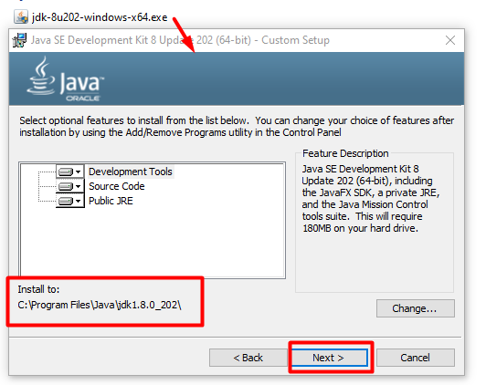
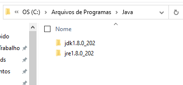
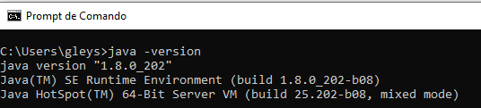

# Configurando o ambiente

Para começar a desenvolver em Java, é necessário que tenhamos o JDK instalado.

::: tip
É extremamente relevante, determinar a versão do Java que precisa utilizar diante de alguns requisitos do projeto.
:::
Características de cada versão

### Instalando o JDK no Windows

::: info
Algumas IDEs como o [VSCode](https://code.visualstudio.com/docs/java/java-tutorial) já consegue baixar e instalar o JDK e realizar a configuração de forma fácil.
:::

* Busque no Google por Java [JDK xxx](https://www.oracle.com/br/java/technologies/javase/javase8-archive-downloads.html) (versão desejada);
* Selecione a opção **.exe** de acordo com o seu sistema operacional.                                             No meu exemplo eu baixei a versão: [jdk-8u202-windows-x64.exe](https://www.oracle.com/br/java/technologies/javase/javase8-archive-downloads.html#license-lightbox).

* Depois, você precisará realizar um login no site da [Oracle](https://login.oracle.com/mysso/signon.jsp).

* Após realizar o download, executar o instalador para instalar o Java no Windows. Este processo instalará tanto o **JDK** quanto a **JRE**.

::: warning
Evite mudar o diretório de instalação.
:::

* Em seu explorer, deve ter algo mais ou menos assim:

* Precisamos agora, validar se a instalação também já configurou nossa variável de ambiente, para poder executar o Java pelo Prompt de comando ou PowerShell do Windows.
* Abra o Prompt de comando e execute o comando `java -version`.

::: info
Não iremos configurar as variáveis de ambiente, pois não é um pré-requisito para desenvolver em Java, considerando que iremos usufruir das mais poderosas IDEs para aumentar nossa produtividade em codificar na linguagem.
:::