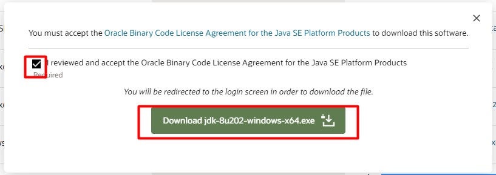
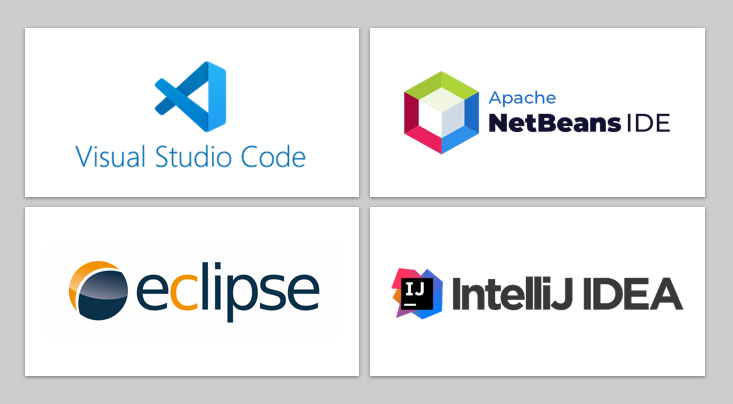

# Configurando o ambiente

Para começar a desenvolver em Java, é necessário que tenhamos o JDK instalado.

::: tip
É extremamente relevante, determinar a versão do Java que precisa utilizar diante de alguns requisitos do projeto.
:::
Características de cada versão

## Instalando o JDK no Windows

::: info
Algumas IDEs como o [VSCode](https://code.visualstudio.com/docs/java/java-tutorial) já consegue baixar e instalar o JDK e realizar a configuração de forma fácil.
:::

* Busque no Google por Java [JDK xxx](https://www.oracle.com/br/java/technologies/javase/javase8-archive-downloads.html) (versão desejada);
* Selecione a opção **.exe** de acordo com o seu sistema operacional.                                             No meu exemplo eu baixei a versão: [jdk-8u202-windows-x64.exe](https://www.oracle.com/br/java/technologies/javase/javase8-archive-downloads.html#license-lightbox).

* Depois, você precisará realizar um login no site da [Oracle](https://login.oracle.com/mysso/signon.jsp).

* Após realizar o download, executar o instalador para instalar o Java no Windows. Este processo instalará tanto o **JDK** quanto a **JRE**.

::: warning
Evite mudar o diretório de instalação.
:::

* Em seu explorer, deve ter algo mais ou menos assim:

* Precisamos agora, validar se a instalação também já configurou nossa variável de ambiente, para poder executar o Java pelo Prompt de comando ou PowerShell do Windows.
* Abra o Prompt de comando e execute o comando `java -version`.

::: info
Não iremos configurar as variáveis de ambiente, pois não é um pré-requisito para desenvolver em Java, considerando que iremos usufruir das mais poderosas IDEs para aumentar nossa produtividade em codificar na linguagem.
:::

## Escolha sua IDE

Para aumentar nossa produtividade, nós podemos escolher algumas ferramentas denominadas de IDE - Integrated Development Environment ou Ambiente de Desenvolvimento Integrado. 

É um software que dispõe de recursos que auxiliar muito nosso desenvolvimento como:

* Aceleração de nossa escrita com **Auto-complete** ou **IntelliSense**
* Formatação de palavras e blocos de códigos
* Análise de erro de sintaxe
* Compilação de programa
* Depuração (acompanhamento) de execução do programa.

Cada IDE dispõe de recursos comuns ou plugins específicos para te auxiliar na agilidade de desenvolvimento.

::: tip
Antes de escolhar sua IDE super recomendamos realizar uma pesquisa e ter uma experiência em cada uma delas.
:::

* Eclipse: Mais utilizada no ambiente corporativo com interface bem interativa.
* NetBeans: Utilizada mais em ambiente acadêmico e com versão de menu e assistentes em português.
* IntelliJ: Ofereça muitos recursos de inteligência para agilidade de nosso desenvolvimento com sugestões de ações bem assertivas.
* VS Code: Hoje muito utilizada por desenvolvedores que já atuam com NodeJs ou plataformas de front-end.

## Eclipse

O [Eclipse IDE](https://www.eclipse.org/downloads/) é uma alternativa muita comum de encontrar ambientes de desenvolvimento, principalmente pelo aspecto de uma interface simples, plugins para recursos adicionais, atalhos para operações de menu e de escrita e para quem trabalhar com Java Swing você pode adicionar o plugin [WindowBuilder](https://www.eclipse.org/windowbuilder/download.php) que de dispõe de  uma interface gráfica para criar as telas gerando o código de layout para o desenvolvedor.

::: warning
Se houver algum erro, quanto a versão do Java no Eclipse, [veja o vídeo pelo link](https://www.youtube.com/watch?v=CgwpdheXvls)
:::

## IntelliJ

O [IntelliJ](https://www.jetbrains.com/pt-br/idea/) é uma plataforma de código aberto para criação de IDEs e ferramentas para desenvolvedores, mas nem todos os recursos estão disponíveis de forma gratuita.

Mesmo com a proposta de ser inteligente, talvez em um primeiro contato, é difícil já desfrutar de todos os recursos, fazendo com você opte por mudar ou voltar para uma IDE  como o Eclipse. Claro que não podemos deixar de destacar que muitas coisas a gente não precisa se como: Salvar aquivo, encode padrão UTF-8 e sugestões que vão surgindo ao longo da nossa interação com a ferramenta.

## Visual Studio Code

Desenvolvido pela Microsoft, é uma editor de texto muito simples e interativo que conta com inúmeras extensões, temas variados e integração com tecnologias como NodeJS e Java.

Comparando-se em performance, o VS Code demonstra um grande desempenho de inicialização, codificação e execução dos programas desenvolvidos.

#### Resumindo:

* **Eclipse**: Mais utilizada no ambiente corporativo com interface bem interativa.
* **NetBeans**: Utilizada mais em ambiente acadêmico e com versão de menu e assistentes em português.
* **IntelliJ**: Ofereçe muitos recursos de inteligência para agilidade de nosso desenvolvimento, com sugestões de ações bem assertivas.

## Mão na massa

Vamos explorar alguns principais recursos utilizando as IDEs, Eclipse, IntelliJ e VSCode.

* O que são workspaces ?
* Definir a JDK na IDE
* Criar \ abrir um projeto Java
* Criar \ importar um projeto Maven
* Conhecer os principais atalhos
* Code Snippet
* Executar \ Depurar nosso programa
* Conhecer alguns atalhos

::: info
**Maven**, é uma ferramenta de automação de compilação utilizada primariamente em projetos Java, mas hoje ambém é utilizada para construir e gerenciar projetos escritos em C#, Ruby, Scala e outras linguagens
:::

## Atalhos

Todas as IDEs possuem combinações de comandos que são facilitadores para criação de arquivo, digitação de códigos, localização e execução das classes em nosso programa, além de comandos já pré-definidos de linhas de código (code snippet).

> _**Code Snippets**_, que numa tradução livre seria algo como “retalhos de código”,  são pedaços de código pré-fabricados e parametrizáveis que podemos inserir em nossa aplicação\
> \
> [Linha do código](http://www.linhadecodigo.com.br/artigo/2274/code-snippets.aspx#ixzz7KEQ3PlmT)

#### Comparação de alguns atalhos

| Comando                             | Eclipse                     | IntelliJ       |
| ----------------------------------- | --------------------------- | -------------- |
| Cria o método principal main        | main,  ctrl + espaço, enter | psvm           |
| Localiza recurso \ arquivo          | ctrl + shit + R             | ctrl+shift + N |
| Método de impressão no Console      | sysout, ctrl + espaço       | sout           |
| Renomeando variável ou método       | alt+shift+R                 | shift + F6     |
| Localizar a utilização de um método | ctrl+shift+G                | alt + F7       |
| Entrar na implementação do método   | ctrl+click                  | ctrl+click     |

#### Referências

* [Visual Studio Code: Instalador para Java - Loiane Groner](https://www.youtube.com/watch?v=vim1bTa-Bkc)
* [Produtividade com Eclipse - Algaworks](https://blog.algaworks.com/atalhos-e-configuracoes-para-ganhar-produtividade-com-eclipse)
* [Eclipse Atalhos - Eclipse](http://www.w3big.com/pt/eclipse/eclipse-shortcuts.html)
* [Eclipse Atalhos - Francisco Kindermann](https://medium.com/@francisco.kindermann/alguns-atalhos-do-eclipse-65ad47eec6ae)
* [IntelliJ Atalhos - BaseF](http://www.basef.com.br/index.php/Atalhos_do_IntelliJ_Idea)