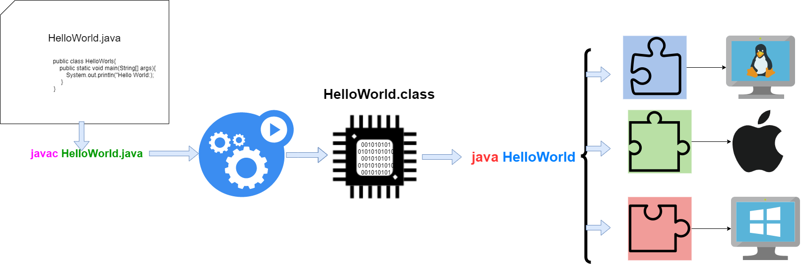

# Uma breve história

Em 1992, A Sun criou um time (conhecido como Green Team) para desenvolver inovações tecnológicas. Esse time foi liderado por James Gosling, considerado o Pai do Java.

A ideia de criar um interpretador para pequenos dispositivos, facilitando a reescrita de software para aparelhos eletrônicos. O projeto resultou em uma linguagem baseada em C e C++ chamada Oak.

A inspiração do nome Java surgiu em uma cafeteria local, cujo café vinha de uma ilha da Indonésia chamada Java. 1993 e a Sun aposta no imediato potencial de utilizar Java para criar páginas da Web com o chamado conteúdo dinâmico.

## **Java em todo lugar**

* Páginas da Web com conteúdo interativo e dinâmico;
* Aplicações corporativas de grande porte;
* Softwares destinados ao consumidor final;
* Aplicativos para Smartphones.

## **Principais características**

* **Independente de plataforma:** Programas Java são compilados para uma forma intermediária (bytecodes).
* **Orientado a objetos:** Java é uma linguagem puramente orientada a objetos; Tudo em Java são classes ou instâncias de classes, com exceção de seus tipos primitivos de dados.
* **Coletor de lixo (Garbage Collector):** Possui um mecanismo automático de gerenciamento de memória.
* **Permite Multithreading:** Recursos que permite o desenvolvimento de aplicações capazes de executar rotinas concorrentemente.
* **Tratamento de exceções:** Permite o tratamento de situações excepcionais; Possui exceções embutidas e permite a criação de novas exceções.

## **Processo de desenvolvimento**

* Todo código fonte escrito em arquivo texto possui extensão **.java**;
* Este arquivo é compilado com o **javac** gerando o arquivo **.class**;
* O arquivo **.class** não contém código de máquina nativo, e sim o `bytecodes`.

## JVM

**Máquina virtual Java** (em [inglês](https://pt.wikipedia.org/wiki/L%C3%ADngua\_inglesa): _Java Virtual Machine_, **JVM**) é um programa que carrega e executa os aplicativos [Java](https://pt.wikipedia.org/wiki/Linguagem\_de\_programa%C3%A7%C3%A3o\_Java), convertendo os [bytecodes](https://pt.wikipedia.org/wiki/Bytecode\_Java) em código executável de máquina. A JVM é responsável pelo gerenciamento dos aplicativos, à medida que são executados.

Graças à máquina virtual Java, os programas escritos em Java podem funcionar em qualquer plataforma, de hardware e software que possua uma versão da JVM, tornando assim essas aplicações independentes da plataforma onde funcionam.

&#x20;                                                                                                                                                     [_Wikipedia_](https://pt.wikipedia.org/wiki/M%C3%A1quina\_virtual\_Java)__

## Plataformas Java

A linguagem Java conta com quatro ambientes de desenvolvimento:

* **JSE (Java Standard Edition):** É a base da plataforma; inclui o ambiente de execução e as bibliotecas comuns é voltada a aplicações para PCs e servidores.
* **JEE (Java Enterprise Edition):** A edição voltada para o desenvolvimento de aplicações corporativas e para a internet.
* **JME (Java Micro Edition):** É a edição para o desenvolvimento de aplicações para dispositivos móveis e embarcados.
* **JFX (Java FX):** JavaFX é uma tecnologia de software que, ao ser combinada com Java, permite a criação e implantação de aplicações de aparência moderna e conteúdo rico de áudio e vídeo.

## Componentes da plataforma

O Java se subdivide em componentes de desenvolvimento (JDK) e de execução (JRE), isso quer dizer que, se pretende desenvolver aplicações é necessário ter instalado o JDK, mas para disponibilizar o executável (.jar) simplesmente a instalação da JRE será o suficiente.

**JDK (Java Development Kit) - Kit de Desenvolvimento Java**

* Composto pelo Compilador (javac + JVM);
* Visualizador de applets, bibliotecas de desenvolvimento;
* Programa para composição de documentação (javadoc);
* Depurador básico de programas e versão da JRE.

**JRE (Java Runtime Environment) - Ambiente de Execução Java**

* É composta de uma JVM e por um conjunto de bibliotecas que permite a execução de softwares em Java;
* Apenas permite a execução de programas, ou seja, é necessário o programa Java compilado pela JDK gerando os arquivos **.class**.

## Evolução da plataforma

Em breve infográfico

Exercício

1. Pesquise e faça um resumo sobre plataforma do Java.
2. Pesquise e faça um resumo sobre a evolução da linguagem Java.
