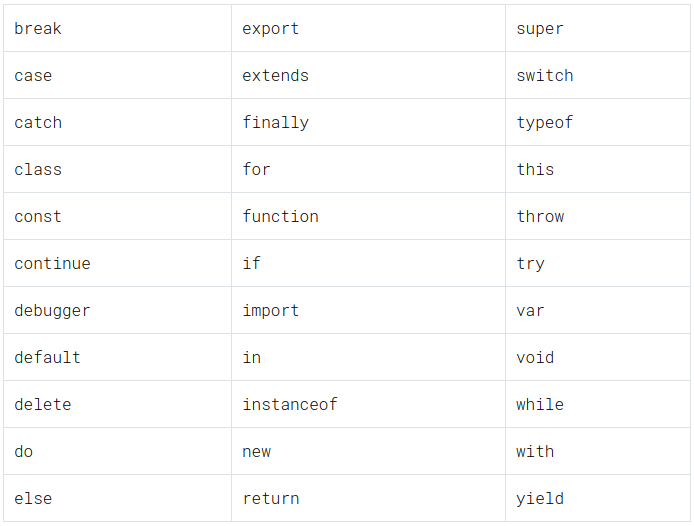

# Conceito
Palavras reservadas são aquelas que já fazem parte da sintaxe do Javascript. Como são reservadas, não podem ser usadas para nomear variáveis em programas escritos em Javascript, por exemplo:

::: warning Futuro
As seguintes palavras-chave estão reservadas para uso futuro na especificação ECMAScript. Atualmente elas não tem funcionalidade, mas poderão ter no futuro, portanto elas também não podem ser usadas como identificadores.
:::

## Principais Palavras Reservadas

`Class` - Uma palavra bem utilizada hoje em dia, pois a partir da famosa versão ecmascript 2015 podemos criar classes, que são uma sintaxe sugar para os tão famosos prototypes hoje em dia é bem comum você ver um código javascript utilizando class.

`This` - Essa é uma palavra reservada que causa muitas lagrimas e confusão (principalmente para quem vem de outras linguagens).

`Function` - Usando para declarar uma função dentro do JavaScript.

`If` e `Else` - Usados para criar condições dento javascript, se você já estudou estrutura de dados são instruções bem comuns, se você ainda não viu, de forma bem simplista, essa estrutura serve para controlarmos o que um usuário, pode ou não ver.

`For` - Agora que falamos de condições, temos os laços, eles são conhecidos como loop, eles ficam dentro desse loop, até suas condições serem completadas, além do `for` existe o `do while` e `while` que não são tão comuns em javascript,

`Return` - Ela é usada para finalizar a execução de uma função com os valores que devem ser retornados

**Referências**
* [Início - Kenzie](https://kenzie.com.br/blog/variaveis-javascript/#:~:text=Palavras%20reservadas%20s%C3%A3o%20aquelas%20que,%2C%20short%2C%20let%2C%20etc.)
* [Principais - Medium](https://medium.com/trainingcenter/palavras-chave-que-todo-dev-javascript-precisa-saber-21338a90da51)