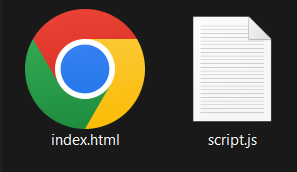

# Iniciando

Para começar a desenvolver em JavaScript é necessário identificar se o nosso projeto terá a finalidade de renderizar páginas htmls ou desenvolvimento para o back-end como o uso do [Node.Js](https://pt.wikipedia.org/wiki/Node.js).

Abaixo iremos realizar um passo a passo ilustrando o mínimo necessário para explorar a linguagem JavaScript através de um navegador como: [Google Chrome](https://www.google.com/intl/pt-BR/chrome/) e [Mozilla Firefox](https://www.mozilla.org/pt-BR/firefox/new/).

## Passo a Passo

1. Primeiramente, criarmos uma pasta chamada `curso-js` com os seguintes documentos de texto: `index.html` e `script.js`.




2. Ao abrir o arquivo `index.html` com seu bloco de notas, determine a estrutura do seu documento conforme o exemplo abaixo:

```html
<html> 
    <head>Curso JS</head> 
    <body>
        <h1>Minha Primeira Página</h1>
    </body> 
</html>
```
Conhecendo as principais tags do html

::: details A tag HTML
```html
<!-- Eu sou a tag principal a mãe de todas as tags em um arquivo .html -->
<html>
 ...
</html>
```
:::

::: details A tag HEAD
```html
<!-- Eu sou a tag cabeça onde é possível informar o título da página, 
os arquivo de estilos e arquivos de escripts como os JavaScripts -->
<head>
 ...
</head>
```
:::

::: details A tag BODY
```html
<!-- Eu sou a tag corpo que é exibido pelo navegador em sua janela, 
ou seja, todo o conteúdo visível do site -->
<body>
 ...
</body>
```
:::

::: details A tag SCRIPT
```html
<!-- Eu sou a tag script, crio um espaço para que um código de programação javascript 
seja incorporado dentro do próprio documento HTML. 
Posso ser inserida tanto na tag HEAD quanto no final da tag BODY-->
<script>
 ...
</script>
```
:::

3. Vamos agora executar nossa tag `<script>` no documento .html, exibindo a mensagem: 'Olá, Mundo!'.
::: details Exibindo na Tela
```html
<!-- Usamos document.write para escrever na tela -->
<html> 
    <head>
        <script>document.write('Olá, Mundo!')</script>
    </head> 
    <body>
        <h1>Minha Primeira Página</h1>
    </body> 
</html>
```
:::
::: details Exibindo no Console
```html
<!-- Usamos console.log para escrever no console -->
<html> 
    <head>
        <script>console.log('Olá, Mundo!')</script>
    </head> 
    <body>
        <h1>Minha Primeira Página</h1>
    </body> 
</html>
```
:::