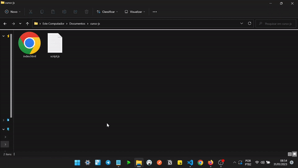
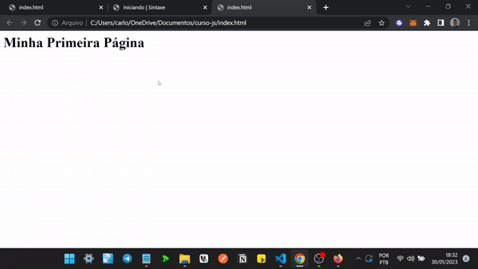
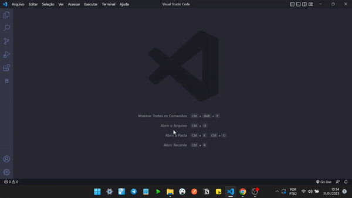
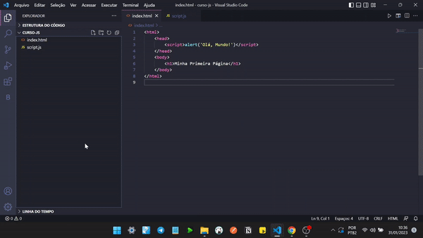
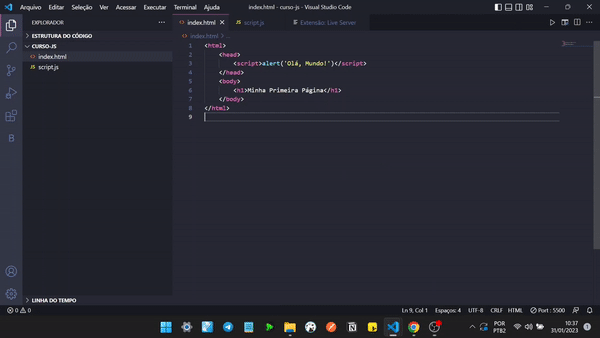
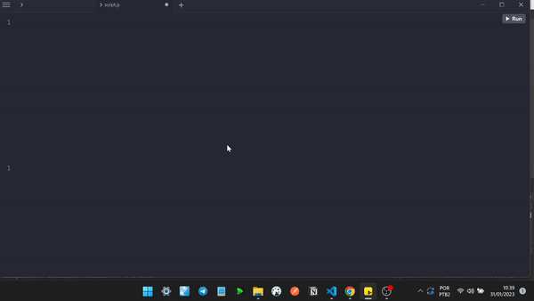

# Iniciando

Para começar a desenvolver em JavaScript é necessário identificar se o nosso projeto terá a finalidade de renderizar páginas htmls ou desenvolvimento para o back-end como o uso do [Node.Js](https://nodejs.org/en/download/).

Abaixo iremos realizar um passo a passo ilustrando o mínimo necessário para explorar a linguagem JavaScript através de um navegador como: [Google Chrome](https://www.google.com/intl/pt-BR/chrome/) e [Mozilla Firefox](https://www.mozilla.org/pt-BR/firefox/new/).

## Passo a Passo

1. Primeiramente, criarmos uma pasta chamada `curso-js` com os seguintes documentos de texto: `index.html` e `script.js`.


2. Ao abrir o arquivo `index.html` com seu bloco de notas, determine a estrutura do seu documento conforme o exemplo abaixo:

```html
<html> 
    <head>Curso JS</head> 
    <body>
        <h1>Minha Primeira Página</h1>
    </body> 
</html>
```
Conhecendo as principais tags do html

::: details A tag HTML
```html
<!-- Eu sou a tag principal a mãe de todas as tags em um arquivo .html -->
<html>
 ...
</html>
```
:::

::: details A tag HEAD
```html
<!-- Eu sou a tag cabeça onde é possível informar o título da página, 
os arquivo de estilos e arquivos de escripts como os JavaScripts -->
<head>
 ...
</head>
```
:::

::: details A tag BODY
```html
<!-- Eu sou a tag corpo que é exibido pelo navegador em sua janela, 
ou seja, todo o conteúdo visível do site -->
<body>
 ...
</body>
```
:::

::: details A tag SCRIPT
```html
<!-- Eu sou a tag script, crio um espaço para que um código de programação javascript 
seja incorporado dentro do próprio documento HTML. 
Posso ser inserida tanto na tag HEAD quanto no final da tag BODY-->
<script>
 ...
</script>
```
:::

3. Vamos agora executar nossa tag `<script>` no documento .html, exibindo a mensagem: **Olá, Mundo!** de duas formas:
::: details Exibindo na Tela
```html{4}
<!-- Usamos o comando alert para exibir uma mensagem na tela -->
<html> 
    <head>
        <script>alert('Olá, Mundo!')</script>
    </head> 
    <body>
        <h1>Minha Primeira Página</h1>
    </body> 
</html>
```

:::

::: details Exibindo no Console
```html{7}
<!-- Usamos console.log para escrever a mensagem no console -->
<html> 
    <head>
    </head> 
    <body>
        <h1>Minha Primeira Página</h1>
        <script>console.log('Olá, Mundo!')</script>
    </body> 
</html>
<!-- NOTA: Neste exemplo a tag script está dentro da tag body -->
```

::: warning NOTA
Para visualizar a mensagem gerada é necessário exibir o recurso `console` do seu navegador usando F12 ou a opção `inspencionar`.
:::

## Aumente sua Produtividade
Para agilizar o processo de desenvolvimento, usaremos um editor de código que é basicamente um software feito para uso de programadores para escreverem suas linhas de código.

Usaremos os seguintes: [VSCode](https://code.visualstudio.com/download) e [RunJs](https://runjs.app/).

### Usando o Visual Studio Code

O Visual Studio Code é um editor de código-fonte desenvolvido pela Microsoft para Windows, Linux e macOS.

1. Primeiro abriremos a pasta `curso-js` criada anteriormente em um editor de texto agora utilizando o VSCode:



2. Instalaremos uma extensão no próprio VSCode chamada `Live Server` para abrir e atualizar o `browser` automaticamente: 



3. Executaremos nosso arquivo `index.html` com a extensão baixada anteriormente:



### Usando o RunJs

O RunJs é um aplicativo simples e leve para codificação e execução de código Javascript sem a necessidade de uso do navegador.

1. Inicialmente vamos abrir nosso arquivo `script.js` :


2. Para testarmos executaremos um `console.log` e veremos a mágica acontecer:




#### Referências

* [Estrutura do Documento - Alura](https://www.alura.com.br/apostila-html-css-javascript/03CA-a-spec-html#:~:text=Um%20documento%20HTML%20v%C3%A1lido%20precisa,DOCTYPE%3E%20.)
* [Tag Script - Hostinger](https://www.hostinger.com.br/tutoriais/como-adicionar-javascript-no-html)