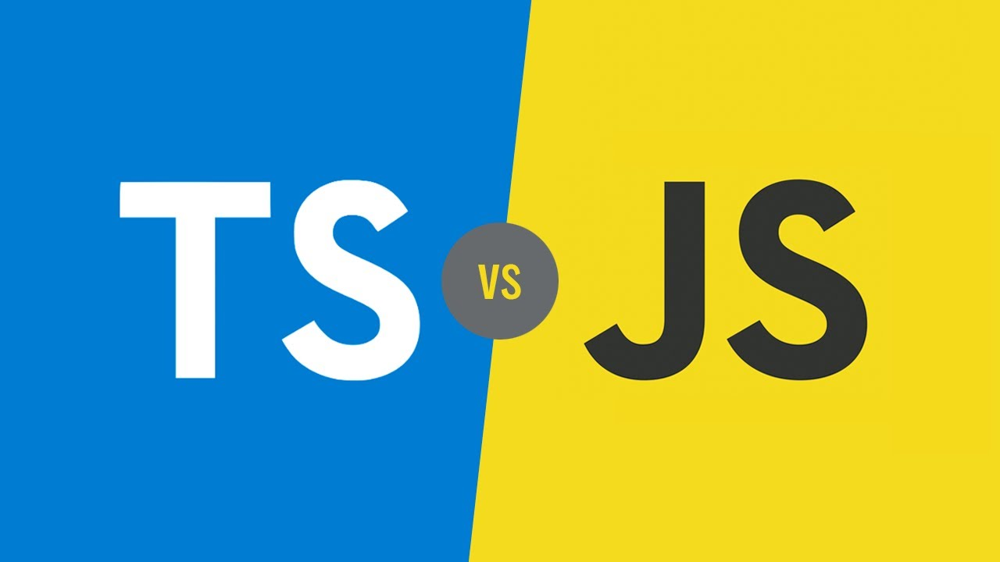

## Esclarecendo
Typescript é um super conjunto de JavaScript, de maneira que pessoas que já utilizam JavaScript têm uma facilidade consideravelmente maior em aprendê-lo.

O Typescript adiciona novas funcionalidades ao JavaScript, pois até pouco tempo, o JavaScript por exemplo, não permitia criar classes, e até módulos, com uma tipagem dinâmica, o que ocasionava muitos erros.

::: warning NOTA
E esses erros não são apontados no momento da implementação.
:::

## Tipagem
O Typescript, por sua vez, tem uma tipagem estática e esta é uma das suas principais vantagens, porque em vez de permitir que você crie um código sem módulos, classes etc, o Typescript exige que sejam construídos códigos mais organizados, e aponta os erros ainda durante a implementação e isso dá uma segurança maior à equipe de desenvolvimento.

## TypeScript VS JavaScript
Por mais que se pareça muito com uma linguagem de programação, é mais apropriado dizer que o TypeScript se define como um conjunto de funcionalidades adicionadas ao JavaScript.

Ou seja, partindo desse princípio, o TypeScript gira em torno dos upgrades da ECMAScript, que tem como foco o JavaScript. 

É a partir daí que suas funcionalidades ganham “corpo” para serem montadas.

Assim, em um projeto no qual o JavaScript será muito utilizado, contar com o TypeScript pode trazer um ganho significativo de produtividade e resultar em um produto mais robusto.

Em resumo, o TypeScript faz a verificação de erros durante a compilação, permitindo gerar JavaScript para diferentes versões do ECMAScript, sem que o usuário passe por grandes preocupações e dores de cabeça.

**Referências**
* [Esclarecimento - Cubos Academy](https://blog.cubos.academy/typescript-quais-as-vantagens-de-aprender-esse-super-set-de-javascript/#)
* [Tipagem - Greek Hunter](https://blog.geekhunter.com.br/introducao-a-typescript/#:~:text=Para%20instala%C3%A7%C3%A3o%20e%20utiliza%C3%A7%C3%A3o%20do,js%20quando%20o%20instalamos.&text=O%20comando%20acima%20instala%20o%20TypeScript%20globalmente%20na%20sua%20m%C3%A1quina.)
* [TypeScript VS JavaScript - TOTVS](https://www.totvs.com/blog/developers/typescript/)

