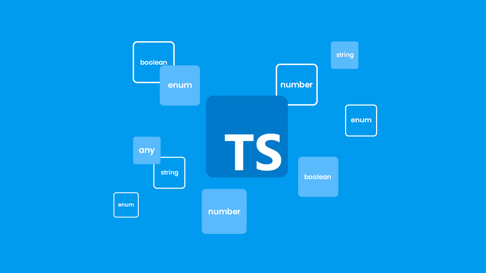

## Uma breve história
O TypeScript começou a ser desenvolvido internamente em 2010 pela equipe da Microsoft. O time foi liderado pelo engenheiro de software Anders Hejlsberg, já conhecido pelo desenvolvimento do Delphi e do Turbo Pascal (Borland), além do .NET (Microsoft). A Microsoft lançou a linguagem em 2012. A sua primeira versão foi a 0.8 e hoje está em 4.5 (em 2021, mas com a 4.6 já lançada em Beta).

## Características
O desenvolvedor pode usar TypeScript com Back-end Node.js. Enquanto isso, no Front-end, a linguagem pode ser usada com Angular 4+ ou ainda com Vue.js e React.js. Basicamente, ao codar em TypeScript o código é “transformado” ou transcompilado, conforme o termo técnico, em JavaScript antes de ser executado. 

## Vantagens
O que é TypeScript está ligado à satisfação do desenvolvedor em codar com uma linguagem incrível. Só para acrescentar, a linguagem é a mais amada por 72,73% dos desenvolvedores ouvidos na pesquisa Stack OverFlow de 2021. Não é para menos. Confira as vantagens: 
1. Recursos avançados
1. Tipagem de dados
1. Integração com o Visual Studio Code

## Motivação
O TypeScript tem como principal objetivo, elevar o nível do Javascript, que inicialmente era utilizado apenas do lado do cliente, em códigos relativamente pequenos e simples. Hoje, isso mudou com a possibilidade de aplicar as melhores práticas de programação à uma arquitetura mais sólida.

## Diferencial
A proposta do TypeScript é facilitar a programação em Javascript, uma vez que podemos acrescentar a ele o conceito de programação orientada a objetos. Com isso, temos grandes benefícios como:
* Criação de métodos que retornam um valor com um tipo definido
* Criação de classes nos softwares
* Criação de interfaces para desacoplar tudo que for possível e uma série de técnicas
* Fazer uso de princípios como: Encapsulamento, Herança, Abstração e Polimorfismo
* Compilação para o Javascript, ou seja, toda a programação feita em Typescript será codificada em Javascript

Um dos principais recursos que o TypeScript traz é a utilização da tipagem estática para o JavaScript, que trabalha com tipagem dinâmica. Desta forma o desenvolvedor tem a responsabilidade de declarar qual o tipo da variável que será utilizada.

## Evolução
Com relação a evolução, notamos um crescimento no desenvolvimento de aplicativos de grandes proporções, sendo escritos em Javascript, embora a criação de aplicativos Javascript em larga escala seja uma tarefa difícil. É aí que surge o TypeScript, para solucionar a criação em larga escala.

**Referências**

* [História, Características e Vantagens - Coodesh](https://coodesh.com/blog/dicionario/o-que-e-typescript/#:~:text=O%20TypeScript%20come%C3%A7ou%20a%20ser,lan%C3%A7ou%20a%20linguagem%20em%202012.)
* [Motivação, Diferencial e Evolução - Blog Programathor](https://programathor.com.br/blog/typescript/#:~:text=O%20TypeScript%20tem%20como%20principal,c%C3%B3digos%20relativamente%20pequenos%20e%20simples.)

